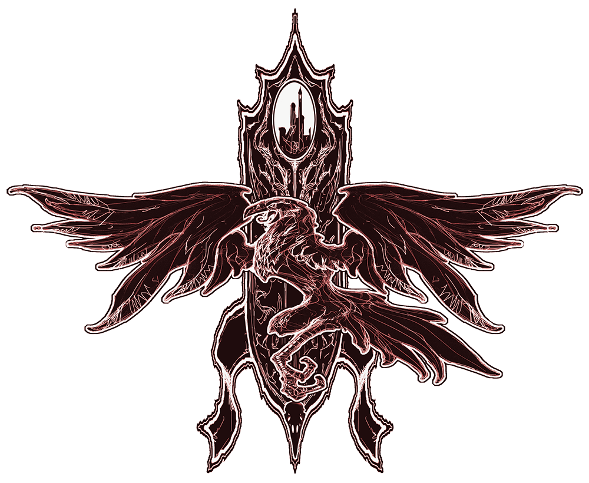

# Session 01
## Day 1
### The road
When I meet Elivra and Xyrith in a tavern, I was preparing to travel towards Waterdeep from Neverwinter. The roads where reportedly quite unsafe with bandits roaming, so when they both said they where heading the same way i was relived.

We set out and the travels where uneventful, untill we got to a small town, where the tavern owner was hosting a tournament. We decided to join in as a team(see what i did there?)

We where supprised by the lack of competition in the first three rounds we fought. But in the final bout we faced a team concisting of a Half-Orc, a Human and a Aarakocra. 
The Human and the Aarakocra proved a bit weaker, but the Half-Orc proved to be a challenge, even though he tried to hide out behind a rock for the start of the tournament. 
That did not seem too honourable to me.
Regardless of the Half-Orcs cowardice we did indeed win the tournament, and got a nice paycheck of 15 GP and two healing potions

### The stranger
The same evening while we where basking in our glory from the tournament win. We meet a stranger who gave us a sealed letter

The seal was unknown to all of us, but we decided to open the letter
It read:

<blockquote> 
Hail to thee of might and valor.

I, a lowly servant of Barovia, send honor to thee. We plead for thy so desperately needed assistance.

The love of my life, Ireena Kolyana, has been afflicted by an evil so deadly that even the good people of our village cannot protect her. She languishes from her wound, and I would have her saved from this menace.

There is much wealth in this community. I offer all that might be had to thee and thy fellows if thou shalt but answer my desperate plea.

Come quickly, for her time is at hand! All that I have shall be thine!

Kolyan Indirovich
Burgomaster
</blockquote> 

Though our motivations where different, be it to fight evil or the promise of wealth we all agreed to help
Even though none of us had any notion of where Barovia was.

We followed the stranger into the forest, but for some reason he always was a bit ahead of us. It seemed like the fog thickened the further we got.
At some point we noticed that the vegetation seemed to be different from what we where used to.

We passed a large wall with a gate. On each side of the gate there where two headless statues.

A while after passing the gate the fog seemed to thicken even more, and the stranger said that it found us lacking **Dobbeltsjekk**
The stranger said that we must seek out Madame Eva, and then quickly slid into the fog.

Weary from our travels, we decided to set up camp to rest for the night. 
Before we started our rest we wearily checked our surounding. For some reson it appeared to us that we where on a different road than the one we started out on. And that we are somewhere different than we think. 
But atleast the camp seems to be as safe as one could expect.

## Day 2
### The ghost house
Waking up we realise our camp is in a village
Most of the houses seems boarded up and abandoned, but outside one we see to children. They seem upset and one is clutching a doll

I approach them to find out what the problem is.
They say that there is a monster in their house, locked into the basement by their parents. They also say that one of their siblings is still in the house, on the third floor.
When asking how long they had been waiting outside their house, they said a week, but I got the feeling that it was longer than that. I ended up giving them a ration pack as we went to check out the house and try to save the baby

