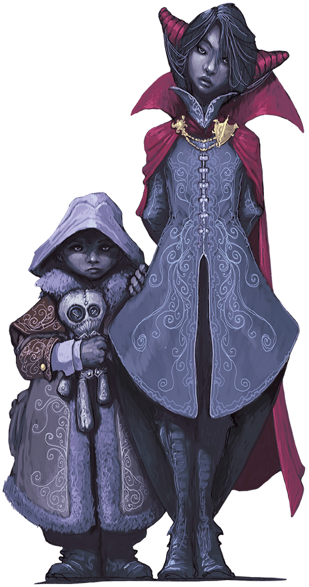
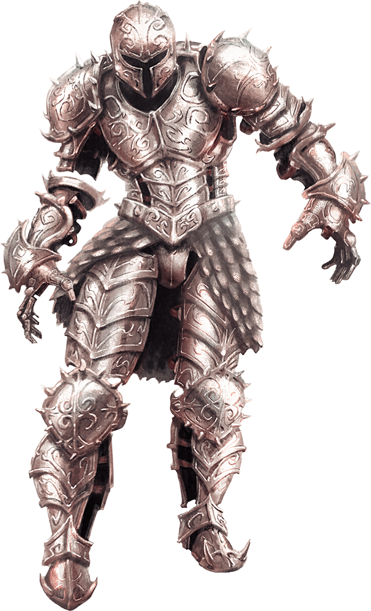
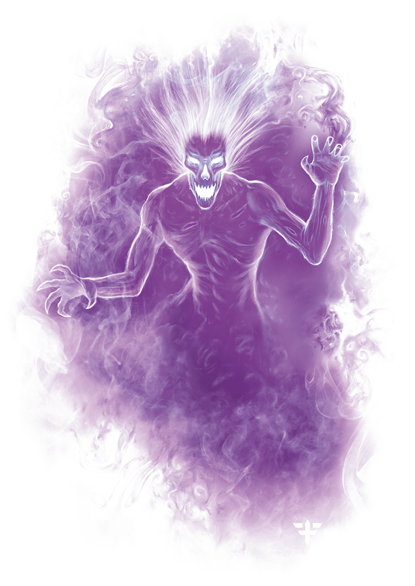

# Session 01
## Day 1
### The road
When I meet Elivra and Xyrith in a tavern, I was preparing to travel towards Waterdeep from Neverwinter. The roads where reportedly quite unsafe with bandits roaming, so when they both said they where heading the same way i was relived.

We set out and the travels where uneventful, untill we got to a small town, where the tavern owner was hosting a tournament. We decided to join in as a team(see what i did there?).

We where supprised by the lack of competition in the first three rounds we fought. But in the final bout we faced a team concisting of a Half-Orc, a Human and a Aarakocra. 
The Human and the Aarakocra proved a bit weaker, but the Half-Orc proved to be a challenge, even though he tried to hide out behind a rock for the start of the tournament. 
That did not seem too honourable to me.
Regardless of the Half-Orcs cowardice we did indeed win the tournament, and got a nice paycheck of 15 GP and two healing potions.

### The stranger
The same evening while we where basking in our glory from the tournament win. We meet a stranger who gave us a sealed letter.

The seal was unknown to all of us, but we decided to open the letter
It read:

<blockquote> 
Hail to thee of might and valor.

I, a lowly servant of Barovia, send honor to thee. We plead for thy so desperately needed assistance.

The love of my life, Ireena Kolyana, has been afflicted by an evil so deadly that even the good people of our village cannot protect her. She languishes from her wound, and I would have her saved from this menace.

There is much wealth in this community. I offer all that might be had to thee and thy fellows if thou shalt but answer my desperate plea.

Come quickly, for her time is at hand! All that I have shall be thine!

Kolyan Indirovich
Burgomaster
</blockquote> 

Though our motivations where different, be it to fight evil or the promise of wealth we all agreed to help
Even though none of us had any notion of where Barovia was.

We followed the stranger into the forest, but for some reason he always was a bit ahead of us. It seemed like the fog thickened the further we got.
At some point we noticed that the vegetation seemed to be different from what we where used to.

We passed a large wall with a gate. On each side of the gate there where two headless statues.

A while after passing the gate the fog seemed to thicken even more, and the stranger said "Seems like the mists judged you and found you wanting, seek seek out my master Madame Eve at the Vistani encampment"
The stranger said that we must seek out Madame Eva, and then quickly slid into the fog.

Weary from our travels, we decided to set up camp to rest for the night. 
Before we started our rest we wearily checked our surounding. For some reson it appeared to us that we where on a different road than the one we started out on. And that we are somewhere different than we think. 
But atleast the camp seems to be as safe as one could expect.

## Day 2
### The ghost house
Waking up we realise our camp is in a village
Most of the houses seems boarded up and abandoned, but outside one we see to children. They seem upset and one is clutching a doll

I approach them to find out what the problem is.
They say that there is a monster in their house, locked into the basement by their parents. They also say that one of their siblings is still in the house, on the third floor.
When asking how long they had been waiting outside their house, they said a week, but I got the feeling that it was longer than that. I ended up giving them a ration pack as we went to check out the house and try to save the baby.
We got the feeling that we where starting to get walled in while outside, but there was nothing we could do about it so we carried on.

After checking the windows for dangers we went inside the house.
While on the first floor, we noticed a picture of the family who presumably, there are two parents, the two children we saw outside. And a third baby. The wife looks at the baby with scorn. 
We also noticed rotting food in the dining room. Wierdly the foot in the pantry was not rotting.
It had a large central staircase on the south wall, and after checking the rooms on the ground floor for dangers, Elvira and I went upstairs to try to find the baby while Xyrith investigated the ground floor.
The first floor hallway was empty so we continued up. 
On the second floor the staircase stopped, in a hallway with a suit of armor, so we tried going to the west wing to try to get further upstairs. Before we got to the door, the suit of armor started attacking us(Quite rudely).

After hearing the noise from the battle, Xyrith decided to join us in the fight. 
In a feat of amazing strenght Elvira manages to toss the armour down to the ground floor, and we take up positions in the staircase and let the armor come to us, to defeat it.

After this battle we decide to search the house more thourogly. Starting at the ground floor, we notice nothing of interest. But on the first floor we find a library containing a hidden room. 
In the hidden room we find a bunch of tooms pertaining to rituals for the Prists of Osibus. A corpse who seemed to have triggered a trap, and a letter from Strahd von Zrovich.

<blockquote>
My most pathetic servant,

I am not a messiah sent to you by the Dark Powers of this land. I have not come to lead you on a path to immortality. However many souls you have bled on your hidden altar, however many visitors you have tortured in your dungeon, know that you are not the ones who brought me to this beautiful land. You are but worms writhing in my earth.

You say that you are cursed, your fortunes spent. You abandoned love for madness, took solace in the bosom of another woman, and sired a stillborn son. Cursed by darkness? Of that I have no doubt. Save you from your wretchedness? I think not. I much prefer you as you are.

Your dread lord and master,
Strahd von Zarovich
</blockquote>

After searching the rest of the floor, we continued back up to the second floor. And to the door to the west wing. 
Opening the door we find a bedroom, it seems to be empty but there is a door to a nursery. As I try to open it a specter appears and attacks me. As if its protecting something. We sense a sadness in it. 

After fighting we get to the nursery where there is a bundle that looks like its contains a child. As we open it, we notice there is nothing there.

Suddenly a person wakes up from the bed and starts berrating us for making to much noise. After a short talk he agrees to join us, he seems stuck here like us. He also heals me. But he does seem weary of us.
We asked him how long he had been here, and he replied a few months. But when asked about what year he thought it was, we was off by a few. It seemed like he had missed some time.
His name is Edwarn.

#### The clean sweep
Continuing to search the second floor, we end up fighting a broom. It seems to be the most deadly foe we have faced thus far, but in a clean sweep we nanaged to kill it. 

We also noticed a bathtub with a finger in it, and a masters beadroom.

From the nursery we continue up to the third floor.

#### The third floor
We find a room with a creepy doll, and both Xyrith and Elvira decided to attack it. We all thought that was reasonable.

There is also a storage room which contains a chest that has the corpse of the nursemaid.

There are was a spare bedroom with nothing of interest.

But finally we opened the last room on the floor, it was locked from the outside with a padlock, we had found the key to the padlock in the library, so we got it open. 
Inside the room there where two corpses of childs, presumably Rosawalda and Thornwald. Two ghosts of the children appeart and try to prevent us from leaving the room.

On this floor there is also a staircase leading down to a cellar, we follow it down.

#### The dungeon
Getting down to the cellar we realise its a crypt. We hear eery chanting and procede with caution.
Searching it the dungeon we find 6 toombs, 5 are the housband, wife and the three children. All are emtpy, except for the wives. that when opened reveals a monster consisting of many caterpillars
We fight it successfully.

Our next step is to continue searching the dungeon and find the source of the chanting.

