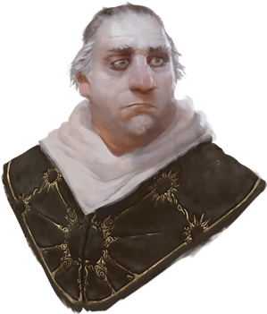
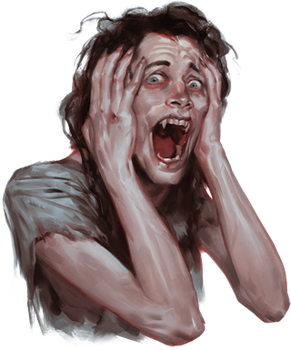

# Session 04

## Tavern
I shared a room with Edwarn. When waking up I inquired into a question I had been wondering about for a while: As far as Edwarn knows sleep shifting is not something thath happens.
I guess thats a good thing.

When we spoke he also asked if i heard a commotion during the night. He said there where lots of sounds and lights. I had not noticed that, but after the last days experences in the deathhouse I was tired.

Edwarn helped me on with my armour, he was quite quick, he seemed to have exprerence in these matters.
While helping me, he had a wierd outburst, followed by him saying "Your knife eared friend is in my head!". Appearently Elvira has some issues with normal boundries, and beeing polite.

## Mirabel
When we got downstairs, we all had some stew and started to chat with a lady named Mirabel.
We asked her about the commotions of last night, she said it was "The march of the dead". Appearently it does not harm anyone. But it is the Ghosts of the dead marching up to ravenloft castle.
I asked her about who or what the Vistani is.
Her reply is that they are Travellers, Drinkmakers, and offer services, for a price. They do not know where they originally are from

## Buildrak
We went to the merchant to stock up on supplies.
Immediatly we got the exhorborant prices confirmed. But we managed to trade the pie i bought yesterday and the vanity box we found for some healers kits and a grappeling hook.
Edward mentioned that there is a smell of death everywhere, and beeing made aware of it i also took note of it.

## Burgon masters house
Our next destination was the burgon masters house. On the way there i noticed the smell of death from lots of houses.
The house it self looked like it had been under attack. There where indications of both wolfs and humans trying to get in.

Inside we took notes of holy symbols everywhere.
Kolyan was in a cask ready to be burried.
We where eager to get Ireena to safety, but she was not willing to go just yet. She both wanted to ensure some safety for the village and get her farher burried.

We immediatly offered to help bury Kolyan. There was a nice funeral.
We left the family the grieve in peace.

Our next destination was the church. We figured we could get some more information there.

## Missing daughter
On the way to the church we heard sobbing from a house. After trying to knock on the door and getting no response, we ended up just going in.
Inside we found a woman named Mary, her daughter had run away from home.
She asked us too look for her. She is 16 years old, have long brown hair, and big eyes, full lips. She looks younger than she is.
We promised to keep an eye out for her

Heading out of the house both Xyrith and I heard Elvira in our head. Why would she invade our minds like this. Such nonsence! We thold her in no uncertain terms to only use that magic when it was neccessary.

## The church
Finally arriving at the church. We notice the same sign of attacks as from the Burgon masters house.
Inside we see the abbed in fervent prayers. He seemed to have been at it for a while. As we approach him we hear someone screaming from the basement. I enquire into this, but he was reluctant to aswer.

After some coercion he told us that this it was his son that was in the basement, but he refused to tell me more unless I promised to not kill his son. I made that promise.
Donavich revealed that the reason his son was locked in the basement was because he had tried to take on Strahd with a wizard in black and some other townsfolk(The wizard in black seemed to be known to Edwarn, a past travel companion).
Regardless the attack failed, and most where killed, expect Doru who was turned into a vampire.
For some reason Strahd let him return to the village.

Keeping a creature locked up in a basement without sustenance seems to be akin to torture, which I cannot abide. So we coerced Donavich to let us meet Doru.
First we spoke through the trapdoor, Doru was pleading for food. Edwarn volunteered to go on a hunt, and soon came back with a deer.
After struggeling to find the key to the basement, we ended up breaking the locks to the trapdoor down to the basement. We tossed down the deer carcass to give some relief to the starving vampire. After eating, the vampire asked for some company.
I was hesitant myself, a vampire is a dangerous creature, but Edwarn agreed to go down.
I must admit, I was unsure on what good this would to. Concidering we promised not to kill Doru.
For me this would have been a mercy killing. But a oath is a oath. What a predicament

In the basement we meet Doru. It was clear that a year in the basement had not done much good to his sanity.
We decided to hear him out. He told us that they had indeed tried to take on Strahd, and that his entire party wiped out, and himself got turned into a vampire.
For me, the obvious mercyful choice would have been to put him out of his missery, but alas, I swore an oath not to kill him.

He complained that he still was hungry. Elvira agreed to let him drink some of her blood. Im unsure if this was a good move, he seemed to get more strength after drinking it, but what is done is done.
Afterwards we made him swear to some simple rules to let him live.
1. He was allowed to hunt in the forrest
2. He must stay out of the village
3. He must not feed on humans, with the exception that his father is allowed to feed him.
4. He must help us in our quest to take on Strahd when the time comes, but he will not be assisting him in the castle since he is afraid of his makers pull over him.

Donavich and Doru both seemed relieved by this resolution, but I must admit, I'm fearing that we have let another monster loose in the village.

