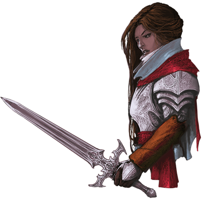

# Session 04

## Tavern
I shared a room with Edwarn. When waking up I inquired into a question I had been wondering about for a while: As far as Edwarn knows sleep shifting is not something thath happens.
I guess thats a good thing.

When we spoke he also asked if i heard a commotion during the night. He said there where lots of sounds and lights. I had not noticed that, but after the last days experences in the deathhouse I was tired.

Edwarn helped me on with my armour, he was quite quick, he seemed to have exprerence in these matters.
While helping me, he had a wierd outburst, followed by him saying "Your knife eared friend is in my head!". Appearently Elvira has some issues with normal boundries, and beeing polite.

## Mirabel
When we got downstairs, we all had some stew and started to chat with a lady named Mirabel.
We asked her about the commotions of last night, she said it was "The march of the dead". Appearently it does not harm anyone. But it is the Ghosts of the dead marching up to ravenloft castle.
I asked her about who or what the Vistani is.
Her reply is that they are Travellers, Drinkmakers, and offer services, for a price. They do not know where they originally are from

## Buildrak
We went to the merchant to stock up on supplies.
Immediatly we got the exhorborant prices confirmed. But we managed to trade the pie i bought yesterday and the vanity box we found for some healers kits and a grappeling hook.
Edward mentioned that there is a smell of death everywhere, and beeing made aware of it i also took note of it.

## Burgon masters house
Our next destination was the burgon masters house. On the way there i noticed the smell of death from lots of houses.
The house it self looked like it had been under attack. There where indications of both wolfs and humans trying to get in.

Inside we took notes of holy symbols everywhere.
Kolyan was in a cask ready to be burried.
We where eager to get Ireena to safety, but she was not willing to go just yet. She both wanted to ensure some safety for the village and get her farher burried.

We immediatly offered to help bury Kolyan. There was a nice funeral.
We left the family the grieve in peace.

Our next destination was the church. We figured we could get some more information there.

## Missing daughter
On the way to the church we heard sobbing from a house. After trying to knock on the door and getting no response, we ended up just going in.
Inside we found a woman named Mary, her daughter had run away from home.
She asked us too look for her. She is 16 years old, have long brown hair, and big eyes, full lips. She looks younger than she is.
We promised to keep an eye out for her

## The church
To get some more information about
